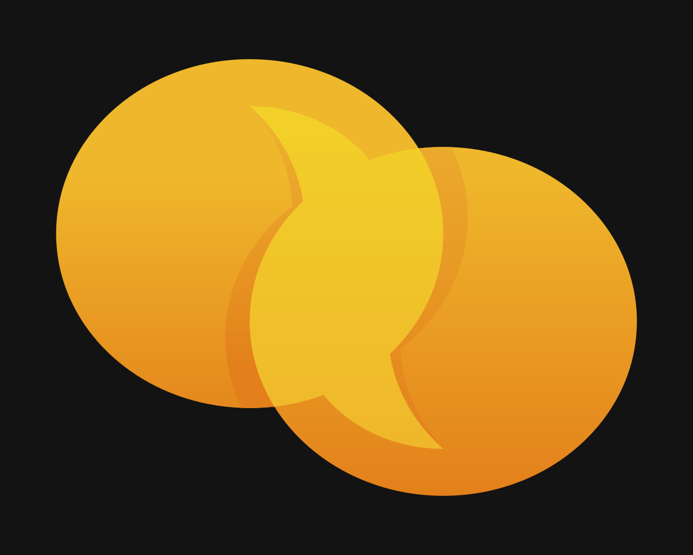

<a name="readme-top"></a>

<!-- PROJECT LOGO -->
<br />
<div align="center">
  <a href="https://github.com/Eddie-Kuo/lingua">
    
  </a>

<h3 align="center">Lingua</h3>

  <p align="center">
    This mobile app is built to bridge the generational gap between parents and their first generation children who are proficient in texting in different languages. Traditionally, using Google Translate has been the "go to solution" in translating text. The problem with using Google Translate is that the translated text is often too literal and sounds robotic. Using AI and specific prompt engineering, Lingua (Latin for language) translates text messages in realtime while preserving the natural way of speaking in the language of choice as if it were from a native speaker.  
    <br />
    <a href="https://github.com/Eddie-Kuo/lingua"><strong>Explore the docs »</strong></a>
    <br />
    <br />
    ·
    <a href="https://github.com/Eddie-Kuo/lingua/issues">Report Bug</a>
    ·
    <a href="https://github.com/Eddie-Kuo/intellicourse-ai/issues/new?labels=enhancement&template=feature-request---.md">Request Feature</a>
  </p>
</div>

<!-- TABLE OF CONTENTS -->
<details>
  <summary>Table of Contents</summary>
  <ol>
    <li>
      <a href="#about-the-project">About The Project</a>
      <ul>
        <li><a href="#built-with">Built With</a></li>
      </ul>
    </li>
    <li>
      <a href="#getting-started">Getting Started</a>
      <ul>
        <li><a href="#prerequisites">Prerequisites</a></li>
        <li><a href="#installation">Installation</a></li>
      </ul>
    </li>
    <li><a href="#features">Features</a></li>
    <li><a href="#contributing">Contributing</a></li>
    <li><a href="#license">License</a></li>
    <li><a href="#contact">Contact</a></li>
    <li><a href="#acknowledgments">Acknowledgments</a></li>
  </ol>
</details>

<!-- ABOUT THE PROJECT -->

## About The Project

_image coming soon_

### Built With


  <ul>
    <li><a href="https://www.typescriptlang.org/">Typescript</a></li>
    <li><a href="https://expo.dev/">React-Native Expo</a></li>
    <li><a href="https://github.com/jaredh159/tailwind-react-native-classnames">TWRNC</a></li>
    <li><a href="https://orm.drizzle.team/docs/overview">Drizzle ORM</a></li>
    <li><a href="https://supabase.com/">Supabase</a></li>
    <li><a href="https://openai.com/">OpenAI</a></li>
  </ul>


<!-- GETTING STARTED -->

## Getting Started

### Prerequisites

This project uses Bun as package manager

```sh
npm install -g bun
```

### Installation

1. Clone the repo

 ```sh
 git clone https://github.com/Eddie-Kuo/lingua.git
 ```

2. Install packages and run app via platform of choice

 ```sh
 bun install
 ```

3. To run this project, you can either use the Expo Go App or Expo pre build. (Recommended pre build)
   
Pre building the app will require additional setup such as installing and setting up Cocoapods and Xcode configurations <br/>
- Cocoapods Installation: https://guides.cocoapods.org/using/getting-started.html <br/>
- Expo Documentation: https://docs.expo.dev/get-started/set-up-your-environment/ <br/>

 ```sh
 // Expo Go
 bunx expo start

 // pre build
 bunx expo run:ios
 ```


   
5. To set up the environment variables, review the'.env.example' file

<!-- ROADMAP -->

## Features

- [ ] Add other users and immediately start chatting
- [ ] Select a language from the supported list of languages and witness the whole app reflect the selected language
- [ ] Messages received from other users in other languages will be automatically translated to your selected language

<!-- CONTRIBUTING -->

## Contributing

Contributions are what make the open source community such an amazing place to learn, inspire, and create. Any contributions you make are **greatly appreciated**.

If you have a suggestion that would make this better, please fork the repo and create a pull request. You can also simply open an issue with the tag "enhancement".
Don't forget to give the project a star! Thanks again!

1. Fork the Project
2. Create your Feature Branch (`git checkout -b feature/amazing-feature`)
3. Commit your Changes (`git commit -m 'Add some amazing feature'`)
4. Push to the Branch (`git push origin feature/amazing-feature`)
5. Open a Pull Request

<!-- LICENSE -->

## License

Distributed under the MIT License. See `LICENSE.txt` for more information.

<!-- CONTACT -->

## Contact

LinkedIn - https://www.linkedin.com/in/eddie-kuo17/

Email - edlankuo@gmail.com

<!-- ACKNOWLEDGMENTS -->

## Acknowledgments

- []()
- []()
- []()

<p align="right">(<a href="#readme-top">back to top</a>)</p>

<!-- MARKDOWN LINKS & IMAGES -->
<!-- https://www.markdownguide.org/basic-syntax/#reference-style-links -->

[contributors-shield]: https://img.shields.io/github/contributors/Eddie-Kuo/intellicourse-ai.svg?style=for-the-badge
[contributors-url]: https://github.com/Eddie-Kuo/intellicourse-ai/graphs/contributors
[forks-shield]: https://img.shields.io/github/forks/Eddie-Kuo/intellicourse-ai.svg?style=for-the-badge
[forks-url]: https://github.com/Eddie-Kuo/intellicourse-ai/network/members
[stars-shield]: https://img.shields.io/github/stars/Eddie-Kuo/intellicourse-ai.svg?style=for-the-badge
[stars-url]: https://github.com/Eddie-Kuo/intellicourse-ai/stargazers
[issues-shield]: https://img.shields.io/github/issues/Eddie-Kuo/intellicourse-ai.svg?style=for-the-badge
[issues-url]: https://github.com/Eddie-Kuo/intellicourse-ai/issues
[license-shield]: https://img.shields.io/github/license/Eddie-Kuo/intellicourse-ai.svg?style=for-the-badge
[license-url]: https://github.com/Eddie-Kuo/intellicourse-ai/blob/master/LICENSE.txt
[linkedin-shield]: https://img.shields.io/badge/-LinkedIn-black.svg?style=for-the-badge&logo=linkedin&colorB=555
[linkedin-url]: https://linkedin.com/in/eddie-kuo17
[product-screenshot]: images/screenshot.png
[Next.js]: https://img.shields.io/badge/next.js-000000?style=for-the-badge&logo=nextdotjs&logoColor=white
[Next-url]: https://nextjs.org/
[React.js]: https://img.shields.io/badge/React-20232A?style=for-the-badge&logo=react&logoColor=61DAFB
[React-url]: https://reactjs.org/
[Vue.js]: https://img.shields.io/badge/Vue.js-35495E?style=for-the-badge&logo=vuedotjs&logoColor=4FC08D
[Vue-url]: https://vuejs.org/
[Angular.io]: https://img.shields.io/badge/Angular-DD0031?style=for-the-badge&logo=angular&logoColor=white
[Angular-url]: https://angular.io/
[Svelte.dev]: https://img.shields.io/badge/Svelte-4A4A55?style=for-the-badge&logo=svelte&logoColor=FF3E00
[Svelte-url]: https://svelte.dev/
[Laravel.com]: https://img.shields.io/badge/Laravel-FF2D20?style=for-the-badge&logo=laravel&logoColor=white
[Laravel-url]: https://laravel.com
[Bootstrap.com]: https://img.shields.io/badge/Bootstrap-563D7C?style=for-the-badge&logo=bootstrap&logoColor=white
[Bootstrap-url]: https://getbootstrap.com
[JQuery.com]: https://img.shields.io/badge/jQuery-0769AD?style=for-the-badge&logo=jquery&logoColor=white
[JQuery-url]: https://jquery.com

